<div align="center">



</div>

<br>

<div align="center">

Minecraft content creator · mod developer · **COO, EdonMe Studios**

</div>

<br>

```bash
$ cat about.md
```

- Building Minecraft mods, datapacks, and tools under **EdonMe Studios**.
- Making YouTube content: gameplay, tutorials, and dev showcases.
- Currently shipping on Fabric 1.21.x — always tinkering with something.

<br>

```bash
$ cat system.md
```

<div align="center">


</div>

<br>

```bash
$ cat tools.md
```

<div align="center">


</div>

<br>

```bash
$ cat stack.md
```

<div align="center">


<br><br>


</div>

<br>

```bash
$ cat focus.md
```

<div align="center">

**Full Stack Development** · **Game Development** · **Minecraft Modding**

</div>

<br>

```bash
$ cat links.md
```

<div align="center">

| platform | url |
|:--|:--|
| YouTube | [youtube.com/@pxdritz1](https://youtube.com/@pxdritz1) |
| Website | [pxdritz.github.io](https://pxdritz.github.io) |
| Modrinth | [modrinth.com/user/pxotitas](https://modrinth.com/user/pxotitas) |
| Discord | [discord.gg/rX8jE45kgP](https://discord.gg/rX8jE45kgP) |

</div>

<br>

<div align="center">


</div>
